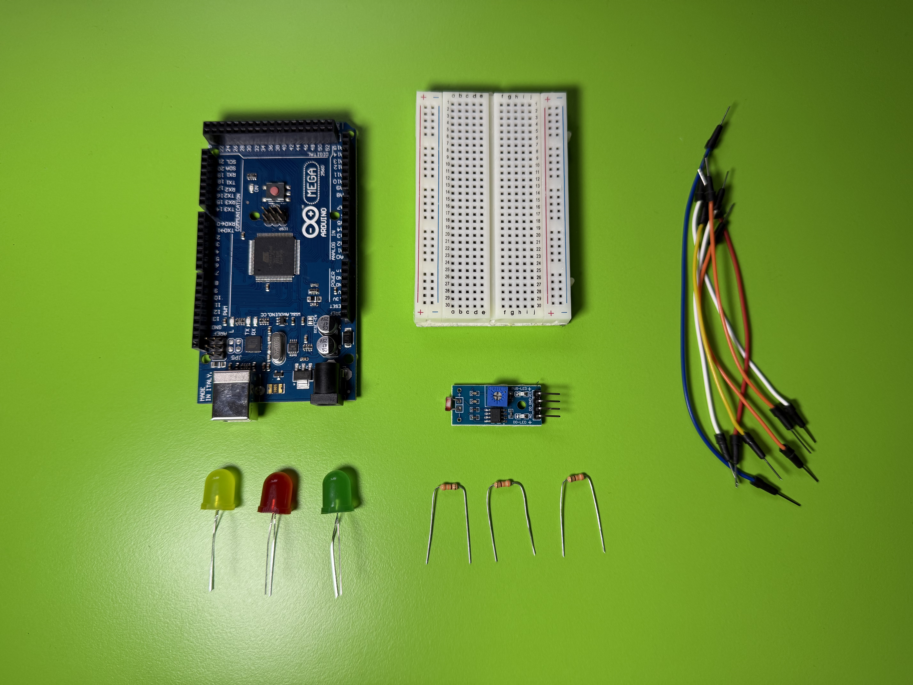
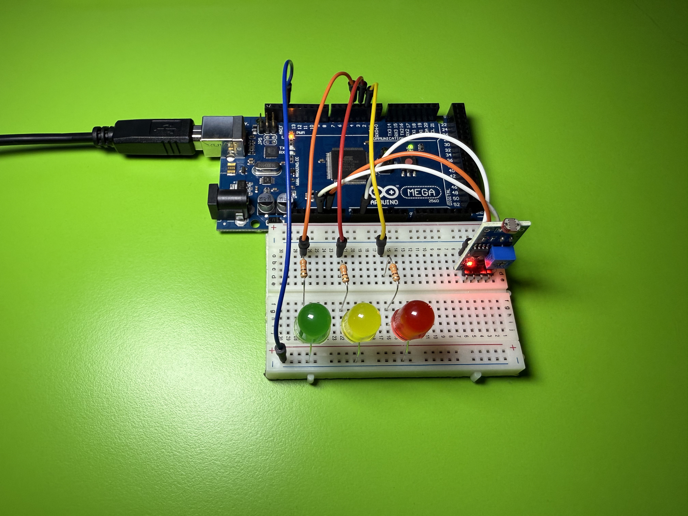

# Projekt – Fotorézistor a LED

Jednoduchý projekt, po kterém se naučíte pracovat s fotorézistorem, jak v digitálním, tak analogovém režimu.

## Potřebné součástky
- Arduino UNO (lze použít jakoukoli Arduino desku, já budu používat MEGA)  
- Fotorézistor  
- LED diody  
- Rezistor 330 Ω  
- Propojovací vodiče  

## Digitální varianta

Nejprve sestavíme jednoduchý příklad, abychom pochopili, jak funguje digitální použití tohoto modulu. Sestavte podle tohoto schématu:

Nyní nahrajte kód `Photoresistor-a-LED.ino` na desku a LED dioda se rozsvítí, pokud je úroveň osvětlení nízká. Pokud to nefunguje, zkuste nastavit potenciometr na desce. Pokud svítí 2 červené diody na modulu, znamená to, že osvětlení je dostatečné.

Video příklad:  

## Analogová varianta

Teď vytvoříme zajímavější verzi. Budeme měřit analogově úroveň osvětlení a LED diody budou našimi kontrolery osvětlení.

Sestavte podle tohoto schématu:  

Nejprve určíme prahové hodnoty osvětlení. Nahrajte program `Photoresistor-analog-test.ino` a otevřete Serial monitor (tlačítko se nachází vpravo nahoře v IDE). Pokud je vše správně, budou se každou sekundu zobrazovat čísla – čím větší jas, tím menší číslo. Určete si podle svého prostředí vhodné hodnoty. Já použil 300, 600, 900.

Nyní nahrajte program `Photoresistor-a-3LED.ino`.  
Při změně osvětlení se rozsvítí určitá LED dioda podle nastaveného prahu.

Příklad, jak by to mělo vypadat:  

---

To je vše, myslím, že se vám projekt povedl!
